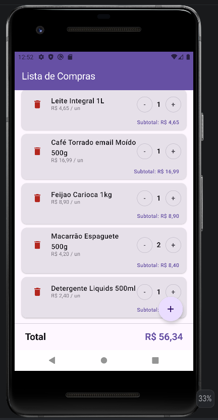
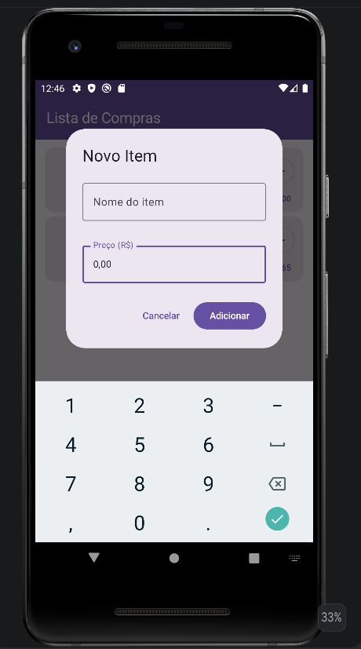

# 🛒 Lista de Compras - Praticidade no seu dia a dia

Uma aplicação Android moderna, simples e eficiente para gerenciar suas listas de compras. Desenvolvida com as tecnologias mais recentes do ecossistema Android para proporcionar uma experiência de usuário fluida e intuitiva.

## 🚀 Funcionalidades

- **Adição Rápida de Itens:** Interface simplificada para focar no que importa: o produto e o preço.
- **Máscara de Moeda em Tempo Real:** Entrada de preços inteligente que formata o valor automaticamente (padrão R$ 0,00) conforme você digita.
- **Memória de Preço:** O app sugere automaticamente o preço do último item adicionado, agilizando o preenchimento.
- **Gestão de Quantidades:** Ajuste facilmente a quantidade de cada item com botões "+" e "-".
- **Cálculo de Totais:** Visualização instantânea do subtotal por item e do valor total da compra no rodapé.
- **Interface Moderna:** Desenvolvida inteiramente em Jetpack Compose com suporte a Material Design 3.

## 🛠️ Tecnologias Utilizadas

- **Linguagem:** [Kotlin](https://kotlinlang.org/)
- **UI Framework:** [Jetpack Compose](https://developer.android.com/jetpack/compose) (Declarative UI)
- **Arquitetura:** Componentes de Arquitetura do Android (State management com `remember` e `mutableStateOf`)
- **Design System:** Material Design 3
- **Networking:** Retrofit & OkHttp (Preparado para integração com API)
- **JSON Parsing:** GSON
- **Gerenciamento de Dependências:** Gradle (Kotlin DSL) com Version Catalog (`libs.versions.toml`)

## 📸 Capturas de Tela

*(Dica: Adicione aqui imagens do seu app após fazer o upload para o GitHub)*

|         Tela Principal          |          Adicionar Item          |
|:-------------------------------:|:--------------------------------:|
|  |  |

## 🏗️ Como rodar o projeto

1. Clone este repositório:
   ```bash
   git clone https://github.com/FilipeTeixeiraSilva/lista-de-compras-android.git
   ```
2. Abra o projeto no **Android Studio** (versão Ladybug ou superior recomendada).
3. Aguarde o Gradle sincronizar as dependências.
4. Execute o app em um emulador ou dispositivo físico com Android 7.0 (API 24) ou superior.

## 📄 Licença e Privacidade

Este projeto está sob a licença MIT. Para detalhes sobre como seus dados são tratados, veja nossa [Política de Privacidade](PRIVACY.md).

---
Desenvolvido por [Filipe Teixeira](https://github.com/seu-usuario) 🚀
